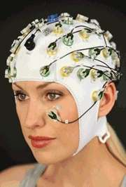
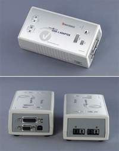

# BrainAmp Setup

???+ info "What this page covers"
    This page summarizes the core hardware used in the CogSys BrainAmp recording setup, how the devices are connected, and how to run a short connection test before every recording session.

## 1. Hardware list

### Visual hardware guide

  

    
    <h3>BrainAmp Standard 32ch + PowerPack</h3>
    
<strong>BrainAmp Standard 32ch</strong> is the main EEG amplifier. It receives the EEG signal, amplifies it, digitizes it, and sends the 32-channel recording stream to the acquisition chain.

    
<strong>PowerPack</strong> supplies battery power to the amplifier system. Using battery power helps reduce mains-related line noise and keeps the recording chain electrically cleaner and more stable.

    
<strong>Practical note:</strong> check the PowerPack charge before every session.

  

  

    
    <h3>actiCAP ControlBox</h3>
    
The ControlBox is the interface between the active cap system and the amplifier chain. It connects the actiCap to the BrainAmp hardware and enables <strong>actiCAP impedance measurement</strong>.

    
<strong>Practical note:</strong> if impedance check is unavailable, this is one of the first devices to inspect.

  

  

    
    <h3>32-channel actiCap + active electrodes</h3>
    
This is the participant-facing EEG cap and electrode set. Each active electrode contains local electronics (a small active circuit / chip) that help buffer the signal close to the scalp and support reliable impedance checking.

    
<strong>Practical note:</strong> electrode contact quality here directly determines signal quality.

  

  

    
    <h3>USB2 Adapter (BUA)</h3>
    
The USB2 Adapter is the USB interface between the BrainAmp hardware and the recording computer. It transfers recorded EEG data to <strong>BrainVision Recorder</strong> and also supports trigger / event signal integration into the recording workflow.

    
<strong>Practical note:</strong> for timing-sensitive experiments, use a separate stimulus computer and recording computer whenever possible.

  

### Quick role summary

| Hardware | Main role | Key thing to remember |
|---|---|---|
| PowerPack | Battery-based power supply for the BrainAmp system | Helps reduce line-noise contamination; charge it before recording |
| BrainAmp Standard 32ch | Main 32-channel EEG amplifier | Acquires, amplifies, and digitizes EEG signals |
| USB2 Adapter (BUA) | USB interface between hardware and recording computer | Carries the acquisition connection and supports trigger integration |
| actiCAP ControlBox | Interface between the cap and amplifier chain | Required for actiCAP impedance measurement |
| 32-channel actiCap + active electrodes | Participant-side active EEG cap system | Electrode contact and impedance quality are critical |

### Recommended computer arrangement

???+ tip "One-computer vs two-computer setup"
    - **Preferred for timing-sensitive or complex experiments:** use a **stimulus presentation computer** and a **separate recording computer**.
    - **Acceptable for simple experiments:** the trigger source and the BUA USB connection can both be connected to the same computer.

## 2. Hardware connection

### Connection logic

  
<strong>Signal chain</strong>

  
Participant → actiCap + active electrodes → actiCAP ControlBox → BrainAmp Standard 32ch → PowerPack → USB2 Adapter (BUA) → Recording computer (BrainVision Recorder)

  
<strong>Trigger chain</strong>

  
Stimulus computer → trigger / event signal → BUA / Recorder workflow

### Step-by-step connection order

1. **Prepare the participant-side hardware**  
   Place the actiCap on the participant and prepare the active electrodes.

2. **Connect the cap to the actiCAP ControlBox**  
   Make sure the cap-side connection is seated firmly.

3. **Connect the ControlBox to the BrainAmp Standard 32ch**  
   This establishes the main EEG signal path.

4. **Connect the PowerPack to the amplifier chain**  
   Confirm that the battery is charged and the unit can support the full session.

5. **Connect the amplifier chain to the USB2 Adapter (BUA)**  
   This creates the interface path toward the recording computer.

6. **Connect the BUA to the recording computer by USB**  
   This computer should be the machine running BrainVision Recorder.

7. **Connect the trigger / event source**  
   If a separate stimulus computer is used, connect its trigger path into the recording workflow through the BUA.

8. **Power on and verify detection**  
   Turn on the devices in the lab's normal order and open the Recorder workspace.

## 3. Hardware connection test

???+ question "When should this test be run?"
    Run a short connection test before every recording session, and again whenever the hardware has been re-cabled or the Recorder workspace has changed.

  

    <h3>Power and detection</h3>
    <ul>
      <li>PowerPack is charged.</li>
      <li>The amplifier chain powers on normally.</li>
      <li>BrainVision Recorder detects the hardware.</li>
      <li>The expected workspace opens correctly.</li>
    </ul>
  

  

    <h3>EEG and impedance</h3>
    <ul>
      <li>The expected 32 EEG channels are visible.</li>
      <li>actiCAP impedance measurement works through the ControlBox.</li>
      <li>Live EEG is plausible, not flat, saturated, or obviously disconnected.</li>
      <li>Touching one electrode causes a local, sensible change.</li>
    </ul>
  

  

    <h3>Triggers and recording</h3>
    <ul>
      <li>Send one or more test triggers.</li>
      <li>Confirm that triggers appear correctly in Recorder.</li>
      <li>Record a short test file.</li>
      <li>Reopen the file if needed and verify that EEG and triggers were saved correctly.</li>
    </ul>
  

### Simple pass criteria

A basic connection test is successful when:

- the hardware powers on normally;
- BrainVision Recorder recognizes the intended setup;
- impedance checking is available;
- the live EEG looks plausible;
- test triggers appear correctly;
- and a short recording can be saved without errors.

## 4. Common connection problems

| Problem | Possible cause | First thing to check |
|---|---|---|
| Amplifier not detected | USB / interface path problem | Check the BUA USB connection and device power state |
| Impedance check not available | ControlBox / cap connection issue | Check the ControlBox connection and cap interface |
| Flat or missing channels | Electrode or cap-side connection problem | Check electrode contact, cap connection, and channel seating |
| Triggers do not appear | Trigger path not connected correctly | Check the trigger cable, trigger source, and Recorder configuration |
| Unstable or noisy data | Power, grounding, or poor electrode contact | Check PowerPack status, electrode preparation, and cable stability |

## 5. Minimum pre-recording note

Before starting a real session, document at least the following:

- hardware configuration used;
- whether one or two computers were used;
- workspace / montage name;
- any unusual cable or power situation;
- and whether the connection test passed.
